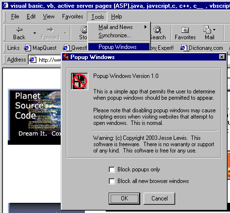



## Popup Windows

### Description

This simple application appears as a menu item under the tool menu in Internet Explorer and permits users to enable and disable popup advertising.

Users may either disable all new popup windows or they may disable only popup advertisements that appear with no menu.
 
### More Info
 
Copy the tlb file in the zip file to the system directory and make sure that VB Shell Library appears in the references. If the library is not listed then browse to the tlb library and add it to the references.

The reg file in the zip file is what adds the code to the Tools menu in Internet Explorer. After compiling the code, create an install package using the Package and Deployment Wizard and include the reg file as part of the install. Run the install to make sure that all of the registry entries are created.

If script debugging is enabled on the machine then it should be disabled because scripts may generate errors as they attempt to access non-existent windows.

             |
---                |---
**Submitted On**   |2003-07-06 12:10:28
**By**             |[Jess Lewis](https://github.com/Planet-Source-Code/PSCIndex/blob/master/ByAuthor/jess-lewis.md)
**Level**          |Advanced
**User Rating**    |4.0 (8 globes from 2 users)
**Compatibility**  |VB 6\.0
**Category**       |[Internet/ HTML](https://github.com/Planet-Source-Code/PSCIndex/blob/master/ByCategory/internet-html__1-34.md)
**World**          |[Visual Basic](https://github.com/Planet-Source-Code/PSCIndex/blob/master/ByWorld/visual-basic.md)
**Archive File**   |[Popup\_Wind161081762003\.zip](https://github.com/Planet-Source-Code/jess-lewis-popup-windows__1-46696/archive/master.zip)

